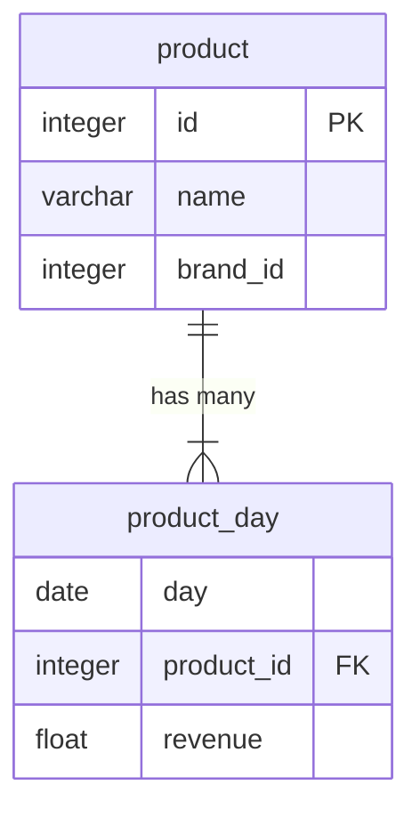

## Revenue Endpoint

We need to create a new endpoint that will return the total revenue for each brand and follows this URL pattern:

`/revenue_by_brand/?take=10&skip=0&start_date=2024-07-01&end_date=2024-07-10&order_by=brand_name&sort_order=asc`

- the `take` parameter should limit the number of results returned. If the `take` parameter is not provided, the endpoint should return all brands.
- the `skip` parameter should be used to skip a number of results. If the `skip` parameter is not provided, the endpoint should return the first `take` results.
- the `start_date` and `end_date` parameters are in `YYYY-MM-DD` format and should be used to filter the results by date and are both optional. They are both _inclusive_.
- the `order_by` parameter should be used to order the results by `brand_name` or `revenue`. If the `order_by` parameter is not provided, the endpoint should order the results by `brand_name`.
- the `sort_order` parameter should be used to sort the results in `asc` or `desc` order. If the `sort_order` parameter is not provided, the endpoint should sort the results in `asc` order.

The endpoint should return the total revenue for each brand. Reponses should be in the following format:

```json
{
    "results": [
        {
            "brand_name": "Amazon",
            "revenue": 100.0
        },
        ...
    ],
    "total_results": 11
}
```

### Database

In our database, we have the following tables:



The migration that creates the `product_day` table is in the repository [here](../migrations/20240723_01_Hwf5L-add-initial-tables.sql).

### Brands API

Due to licensing issues with the data, we cannot store the brands in our database.
Brands are available through a 3rd party API endpoint that returns the following format:

```json
[
  { "id": 1, "name": "Nike" },
  { "id": 2, "name": "Adidas" },
  ...
]
```

The brands list API endpoint is available at [https://mocki.io/v1/a2010207-0811-469c-b7de-aae5c195767a](https://mocki.io/v1/a2010207-0811-469c-b7de-aae5c195767a)
